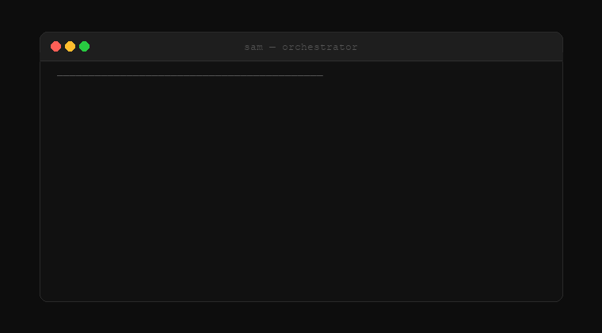

# Claude Team Workspace Template

**An AI agency in a folder.** Drop this into Claude Code and you have a 20-person team ready to take work — researchers, copywriters, SEO specialists, developers, designers, and more — all coordinated by a single orchestrator named Sam.

---

## What this is

Most AI setups give you one assistant. This gives you a team.

The **Orchestrator** is the single point of contact for every request. They never do the work themselves. Instead, they route each task to the right specialist: SEO audits go to the SEO Specialist, brand copy goes to Finn, UX reviews go to Jordan. Each team member has a detailed persona file defining their expertise, voice, constraints, and relationships.

The team grows with you. When you hit a capability gap, a built-in **hiring pipeline** kicks in: the Senior Researcher researches the role, the HR Lead builds the persona, the Orchestrator announces the new hire and updates the roster. No new infrastructure needed — just new files.

Quality gates are built in too. An Opus-powered advisor — the **Opus Advisor** — is consulted at checkpoints before and after substantive work, catching problems before they reach you.

---

## Quick start

1. Clone or download this repo
2. Open the folder as your working directory in [Claude Code](https://claude.ai/code)
3. Say hello:

```
Hi, what can the team help me with today?
```

That's it. Sam responds immediately. No API keys to wire up, no bootstrapping.

For full setup instructions (including secrets hygiene, path verification, and automated setup via a single Claude prompt): see [setup-guide.md](Resources/setup-guide.md).

---

## How it works

```
Your message
     ↓
  CLAUDE.md               ← orchestrator rules + active roster
     ↓
  Orchestrator            ← routes all requests; never does task work themselves
     ↓
  Team member             ← persona file defines who they are, what they do, what they won't
     ↓
  Opus Advisor (checkpoint) ← Opus advisor consulted before/after durable work
     ↓
  Deliverable             ← lands in Projects/[project]/Deliverables/
```

**Key files:**
- `CLAUDE.md` — the orchestrator's brain; defines the Orchestrator's rules, the hiring pipeline, checkpoint protocol, and the active team roster
- `Team/[Name]/[name]-[role].md` — each team member's persona: identity, expertise, constraints, relationships
- `Resources/SOPs/` — standard operating procedures for checkpoints, repo consultation, project folder structure, theming
- `.claude/skills/` — reusable skill modules (brainstorming, planning, debugging, code review, etc.)

---

## The team

| Role | Description |
|------|------|
| Orchestrator | Routes all requests, manages the roster |
| HR Lead | Builds new team member personas from the Senior Researcher's briefs |
| Senior Researcher | Researches roles before any new hire |
| SEO Specialist | |
| Webflow Developer | |
| Visual AI Producer | |
| Copywriter | |
| Brand Strategist | |
| Content Strategist | |
| UX/UI Designer | |
| Social Media Manager | |
| Video & Motion Producer | |
| Analytics & Reporting Specialist | |
| Creative Technologist | |
| Automation Architect | |
| QA Compliance Reviewer | |
| Project Manager | |
| Creative Director | |
| Amazon Stores Specialist | |
| Opus Advisor | Quality gate at checkpoints |

---

## The hiring pipeline

The team is not fixed. When a capability gap appears:

1. The **Orchestrator** identifies the gap and asks your permission to hire
2. The **Senior Researcher** researches the role — skills, knowledge domains, collaboration patterns, failure modes
3. The **HR Lead** reads the Senior Researcher's brief and writes a full persona file
4. The **Orchestrator** announces the hire and updates the Active Team Roster in `CLAUDE.md`

The new team member is immediately available. No code changes, no config — just a new markdown file.

---

## Sample projects

`Projects/` contains 5 half-finished sample projects. Each teaches a different workflow layer. Work through them after setup to learn the system by doing.

| # | Project | Teaches |
|---|---------|---------|
| 1 | Bloom Bakery — SEO Audit | Standard audit pipeline (Alex → Quinn → Deliverables) |
| 2 | Meridian Law — Homepage UX Review | Cross-functional handoff + WCAG compliance |
| 3 | NovaStar Gym — Social Media Calendar | Multi-specialist creative (Sage → {SocialMediaManager} → Cleo) |
| 4 | Thornwood Coffee — Brand Copywriting | {OpusAdvisor} Checkpoint A+B + repo consultation |
| 5 | Velora Studio — Hire Paid Media Specialist | Full hiring pipeline end-to-end |

Each project has a `README.md` with learning objectives and completion steps.

---

## Customising

**Rename the workspace:**
Duplicate this folder, rename it `Claude - [YourCompany]`, and open that copy in Claude Code. Update the memory path in `CLAUDE.md` to the absolute path of your new folder.

**Add a team member:**
Tell the Orchestrator you have a capability gap. The hiring pipeline handles the rest.

**Remove a team member:**
Tell the Orchestrator to archive them. The Orchestrator moves the persona file to `Vault/Archive/` and removes them from the roster.

**Apply a theme:**
Rename the team to match a theme of your choice (Greek myths, Studio Ghibli, etc.):
> "Set theme to [your theme]"

The Orchestrator will preview changes and ask for confirmation before touching anything. Full rollback map saved to `Vault/Memory/`.

---

## Requirements

- [Claude Code](https://claude.ai/code) — the CLI or desktop app
- Access to Claude models. Odin checkpoints use **Opus** — confirm your plan includes Opus access.
- No external API keys required for basic use

**OS note:** Example paths in `CLAUDE.md` and persona files use Windows-style absolute paths (`J:\My Drive\...`). Update the memory path in `CLAUDE.md` to match your OS and file system before first use.

---

## Repo layout

```
Claude - TEMPLATE/
├── CLAUDE.md                          ← orchestrator rules + team roster
├── README.md                          ← this file
├── .env.example                       ← API key template
├── .claude/
│   └── commands/
│       ├── onboard.md                 ← /onboard command (run first)
│       └── import-repos.md            ← /import-repos command
├── Team/
│   ├── Sam - Orchestrator/
│   ├── Harper - HR Lead/
│   ├── Ryan - Senior Researcher/
│   │   └── Research/                  ← Ryan's role research briefs
│   └── [17 more specialists]/
├── Projects/
│   └── [5 sample onboarding projects]/
├── Resources/
│   ├── setup-guide.md                 ← full setup instructions
│   ├── sam-routing.gif                ← demo animation
│   ├── SOPs/                          ← Advisor Checkpoints, Repo Consultation, etc.
│   └── Git/                           ← cloned reference repos (git-ignored)
├── Vault/
│   ├── Memory/                        ← persistent session memory
│   ├── Archive/                       ← retired projects and personas
│   └── Logs/                          ← clone failure logs, import logs
├── Inbox/                             ← staging area for unrouted material
└── Notes/                             ← daily notes, canvas files, clippings
```

---

## Demo



---

## Licence

MIT. Fork it, adapt it, theme it, extend it.

---

## Contributing

Issues and PRs welcome. If you build a new persona, SOP, or skill worth sharing — open a PR with a brief description of what it covers and why.
