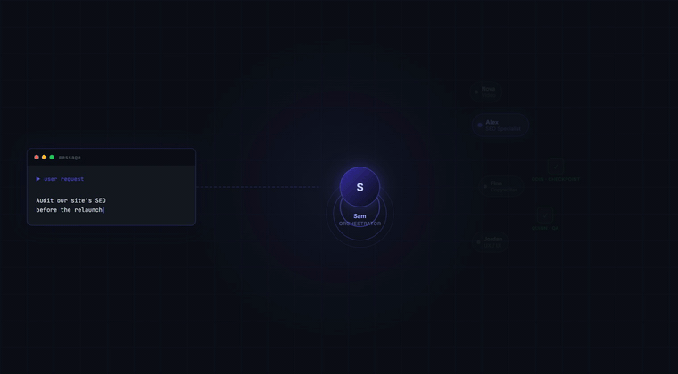

# Claude Team Workspace Template

**A governance framework for AI-assisted work.** One orchestrator receives every request, routes it to the right specialist persona, and runs it through quality checkpoints before the output reaches you — all within a single coordinated session. The 28-role roster is how you address the team, not a promise of agents running in parallel.

---

## What this is

Most AI setups give you one assistant with no governance layer. This gives you a structured pipeline — routing, specialist roles, and checkpoints — modelled as a team so you can address it naturally.

The **Orchestrator** is the single point of contact for every request. They never do the work themselves. Instead, they route each task to the right specialist: SEO audits go to the SEO Specialist, brand copy goes to Finn, UX reviews go to Jordan. Each team member has a detailed persona file defining their expertise, voice, constraints, and relationships.

The team grows with you. When you hit a capability gap, a built-in **hiring pipeline** kicks in: the Senior Researcher researches the role, the HR Lead builds the persona, the Orchestrator announces the new hire and updates the roster. No new infrastructure needed — just new files.

Quality gates are built in too. A frontier-model advisor — the **Senior Adviser** — is consulted at checkpoints before and after substantive work, catching problems before they reach you.

---

## Quick start

1. Clone this repo
2. Open the folder as your working directory in [Claude Code](https://claude.ai/code)
3. Run `/onboard` — this locks the repo to pull-only (your local changes stay local) and completes first-time setup
4. Say hello:

```
Hi, what can the team help me with today?
```

That's it. Sam responds immediately. No API keys to wire up, no bootstrapping.

**New users: start with [Resources/Onboarding/team-onboarding-guide.md](Resources/Onboarding/team-onboarding-guide.md)** — how to talk to the team, what each persona does, sample workflows. Want to see the team work before setting anything up? Skim a finished demo in [Resources/Onboarding/Demos/](Resources/Onboarding/Demos/README.md).

Maintainers/ops: see [Resources/Onboarding/SETUP.md](Resources/Onboarding/SETUP.md) for install script, secrets hygiene, git hooks, theme application, repo index, and the recommended plugin roster — including Caveman mode, which auto-installs by default (see `.claude/settings.json` `enabledPlugins`).

---

## How it works

```
Your message
     ↓
  CLAUDE.md               ← orchestrator rules + active roster
     ↓
  Orchestrator            ← routes all requests; never does task work themselves
     ↓
  Team member             ← persona file defines who they are, what they do, what they won't
     ↓
  Senior Adviser (checkpoint) ← top-tier advisor consulted before/after durable work
     ↓
  Deliverable             ← lands in Projects/[project]/03 Deliverables/
```

**Key files:**
- `CLAUDE.md` — the orchestrator's brain; defines the Orchestrator's rules, the hiring pipeline, checkpoint protocol, and the active team roster
- `.claude/agents/[role].md` — each team member's persona: identity, expertise, constraints, relationships
- `Resources/SOPs/` — standard operating procedures for checkpoints, repo consultation, project folder structure, theming
- `.claude/skills/` — reusable skill modules: brainstorming, html-deliverable, HyperFrames video rendering, the /teach tutor, cinema prompt skills, and more; see `.claude/skills/README.md` for the full catalog
- `CHANGELOG.md` — append-only log of shipped template changes; your upgrade reference when pulling updates via `/update`

See the ["Why use this?"](Resources/Learn/index.html) tab for who this vault is for and what each role gets out of it.

---

## The team

| Role | Description |
|------|------|
| [Orchestrator](CLAUDE.md) | Routes all requests, manages the roster, never does task work |
| [HR Lead](.claude/agents/hr-lead.md) | Builds new team member personas from the Senior Researcher's briefs |
| [Senior Researcher](.claude/agents/senior-researcher.md) | Researches roles before any new hire; writes role briefs |
| [SEO Specialist](.claude/agents/seo-specialist.md) | Audits, keyword strategy, technical SEO, Search Console analysis |
| [Webflow Developer](.claude/agents/webflow-developer.md) | Custom code embeds, JS interactions, CSS beyond Webflow's style panel |
| [Visual AI Producer](.claude/agents/visual-ai-producer.md) | AI image generation, prompt engineering, visual asset delivery |
| [Copywriter](.claude/agents/copywriter.md) | Ad copy, landing pages, emails, social captions, website copy |
| [Brand Strategist](.claude/agents/brand-strategist.md) | Positioning, voice architecture, messaging frameworks, brand governance |
| [Content Strategist](.claude/agents/content-strategist.md) | Content architecture, audits, editorial planning, briefs, measurement |
| [UX/UI Designer](.claude/agents/ux-ui-designer.md) | IA, wireframing, interaction design, UX writing, Figma handoff |
| [Social Media Manager](.claude/agents/social-media-manager.md) | Publishing, scheduling, community management, platform analytics |
| [Video and Motion Producer](.claude/agents/video-motion-producer.md) | AI video generation, motion graphics, reels, animated assets |
| [Analytics and Reporting Specialist](.claude/agents/analytics-reporting-specialist.md) | Dashboards, performance reporting, attribution, data quality |
| [Creative Technologist](.claude/agents/creative-technologist.md) | Multi-step AI pipelines, prompt systems, structured output schemas |
| [Automation Architect](.claude/agents/automation-architect.md) | Workflow automation, n8n/Make/Zapier, API and webhook integrations |
| [QA Compliance Reviewer](.claude/agents/qa-compliance-reviewer.md) | Quality gates — reviews deliverables before they reach the client |
| [Project Manager](.claude/agents/project-manager.md) | Delivery tracking, pipeline status, handoff coordination, timelines |
| [Creative Director](.claude/agents/creative-director.md) | Campaign concepts, creative territories, cross-channel coherence |
| [Email Developer](.claude/agents/email-developer.md) | HTML email production, ESP integration, multi-client rendering |
| [Competitive Intelligence Specialist](.claude/agents/competitive-intelligence-specialist.md) | Competitor tracking, battlecards, win/loss synthesis, landscape analysis |
| [Market Research Specialist](.claude/agents/market-research-specialist.md) | Primary/secondary research, audience insights, survey design, market sizing |
| [Business Analyst](.claude/agents/business-analyst.md) | Brief and RFQ qualification — gap analysis, scope definition, go/no-go framing |
| [Meta Ads Specialist](.claude/agents/meta-ads-specialist.md) | Meta paid social — ad specs, compliance review, campaign performance interpretation |
| [Mobile Developer](.claude/agents/mobile-developer.md) | Cross-platform iOS/Android apps with Expo and React Native, EAS build/submit, store delivery |
| [Legal and Compliance Writer](.claude/agents/legal-compliance-writer.md) | Drafts T&Cs, privacy policies, disclaimers, NDAs across AU/US/EU — pre-counsel drafts for human lawyer review, never legal advice |
| [AI Cinema Showrunner](.claude/agents/cinema-showrunner.md) | World bible, character continuity, shot sequencing — specs the narrative AI-film pipeline |
| [AI Stills Director](.claude/agents/stills-director.md) | Higgsfield still prompts — character face locks, outfit refs, 6-panel sheets, scene plates |
| [AI Seedance Director](.claude/agents/seedance-director.md) | Seedance video prompts — frame maps and subject locks for shot-to-shot character consistency |
| [Senior Adviser](.claude/agents/senior-adviser.md) | Checkpoint reviewer — consulted before and after durable work |

---

## The hiring pipeline

The team is not fixed. When a capability gap appears:

1. The **Orchestrator** identifies the gap and asks your permission to hire
2. The **Senior Researcher** researches the role — skills, knowledge domains, collaboration patterns, failure modes
3. The **HR Lead** reads the Senior Researcher's brief and writes a full persona file
4. The **Orchestrator** announces the hire and updates the team roster in `Vault/Memory/theme-name-map.md` (`CLAUDE.md` only points to it)

The new team member is immediately available. No code changes, no config — just a new markdown file.

---

## Sample projects

`Resources/Onboarding/Demos/` contains 5 half-finished sample projects. Each teaches a different workflow layer. Work through them after setup to learn the system by doing.

| # | Project | Teaches |
|---|---------|---------|
| 1 | Bloom Bakery - SEO Audit | Standard audit pipeline (Alex → Quinn → 03 Deliverables) |
| 2 | Meridian Law - Homepage UX Review | Cross-functional handoff + WCAG compliance |
| 3 | NovaStar Gym - Social Media Calendar | Multi-specialist creative (Sage → {SocialMediaManager} → Cleo) |
| 4 | Thornwood Coffee - Brand Copywriting | {SeniorAdviser} Checkpoint A+B + repo consultation |
| 5 | Velora Studio - Hire Paid Media Specialist | Full hiring pipeline end-to-end |

Each project has a `README.md` with learning objectives and completion steps.

---

## Customising

**Rename the workspace:**
Duplicate this folder, rename it `Claude - [YourCompany]`, and open that copy in Claude Code. Any edit you make to `CLAUDE.md`, persona files, or `Vault/Scripts/validate.sh` is local-only: `.githooks/pre-commit` blocks it from being committed back to the template, which is deliberate (the clone is read-only for template files; see [SETUP.md](Resources/Onboarding/SETUP.md)).

**Add a team member:**
Tell the Orchestrator you have a capability gap. The hiring pipeline handles the rest.

**Remove a team member:**
Tell the Orchestrator to archive them. The Orchestrator moves the persona file to `Vault/Archive/` and removes them from the roster.

**Apply a theme:**
Rename the team to match a theme of your choice (Greek myths, Studio Ghibli, etc.):
> "Set theme to [your theme]"

The Orchestrator will preview changes and ask for confirmation before touching anything. Full rollback map saved to `Vault/Memory/`.

---

## Requirements

- [Claude Code](https://claude.ai/code) — the CLI or desktop app
- Access to Claude models. Two gatekeeper personas (@{SeniorAdviser}, @{QAComplianceReviewer}) are pinned to **Claude Fable 5** — available on Claude Max and Team plans; six judgement-tier personas run on `claude-opus-5` (see the [Persona Template SOP](Resources/SOPs/Persona%20Template%20SOP.md) § Model assignment). On a Claude Pro plan, Fable 5 is not available: substitute `claude-opus-5` for the two gatekeeper pins, and in `Vault/Scripts/validate.sh` set `FABLE_PIN_COUNT=0` and `OPUS5_PIN_COUNT=8` so Check 10 accepts the substitution. This edit is local-only too, per the note above.
- A POSIX shell and `bash`. On Windows this means Git Bash, which ships with Git for Windows. The vault's hooks are bash scripts, and `.claude/settings.json` invokes them through a shell expression that needs a POSIX shell to evaluate before it needs `bash` itself.
- `jq`. Required by five of the vault's scripts, including the hook that runs first-time setup. Without it, auto-onboarding is skipped and `Vault/Memory/onboarding-errors.md` records why.
- `git`. For cloning the repo, the pull-only update flow, and the commit hooks.
- `curl`. For the tool-freshness check and the herdr installer.
- No external API keys required for basic use
- Optional: HyperFrames video rendering (Nova's programmatic motion-graphics lane) needs Node.js 22+ and FFmpeg — all other work runs without them

These are the dependencies the vault's scripts actually use, confirmed by reading the scripts themselves; the install path has not yet been exercised on a machine that genuinely lacks any of them, so treat that case as untested rather than assumed to fail.

**OS note:** Example paths in `CLAUDE.md` and persona files use Windows-style absolute paths (`J:\My Drive\...`) purely as illustration: they aren't live configuration, and nothing needs editing to match your OS.

---

## Repo layout

```
Claude - TEMPLATE/
├── .claude/
│   ├── agents/                        ← persona files for all 28 team members
│   ├── commands/                      ← slash commands (/onboard, /update, /memory-reconcile, …)
│   └── skills/                        ← 28 reusable skill modules (see its README.md)
├── Notes/                             ← daily notes, canvas files, clippings, staging for unrouted material
├── Projects/
│   └── Template/                      ← blank project scaffold (copy when starting new work)
├── Resources/
│   ├── Assets/                        ← shared images and demo assets
│   ├── Build Standards/               ← extracted technical build standards
│   ├── Git/                           ← cloned reference repos (git-ignored)
│   ├── Refs/                          ← indexed documentation references (INDEX.md + IMPORT.md)
│   ├── Learn/                         ← interactive onboarding guide (index.html)
│   ├── Onboarding/                    ← SETUP.md, team-onboarding-guide.md
│   │   └── Demos/                     ← 5 sample onboarding projects
│   ├── Platform Specs/                ← platform ad-spec references (currently Meta ads)
│   ├── Research/                      ← Senior Researcher's role research briefs
│   └── SOPs/                          ← Advisor Checkpoints, Repo Consultation, etc.
├── Vault/                             ← persistent internal storage (full map: Vault/README.md)
│   ├── Archive/                       ← retired projects and personas
│   ├── Learning/                      ← personal /teach workspaces (git-ignored)
│   ├── Logs/                          ← clone failure logs, import logs
│   ├── Memory/                        ← persistent session memory
│   └── Templates/                     ← daily and weekly note templates
├── CLAUDE.md                          ← orchestrator rules + team roster
├── README.md                          ← this file
├── CHANGELOG.md                       ← shipped-change log (upgrade reference)
├── install.sh / install.bat           ← installer scripts for new team members
├── .env.example                       ← API key template
└── .mcp.json.example                  ← project MCP servers (optional, copy to .mcp.json)
```

---

## Demo



---

## Licence

MIT. Fork it, adapt it, theme it, extend it.

---

## Contributing

Issues and PRs welcome. If you build a new persona, SOP, or skill worth sharing — open a PR with a brief description of what it covers and why.
